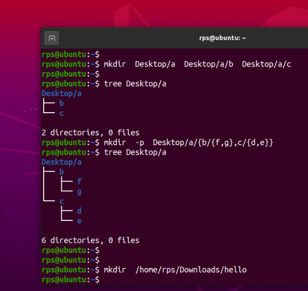
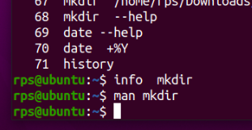
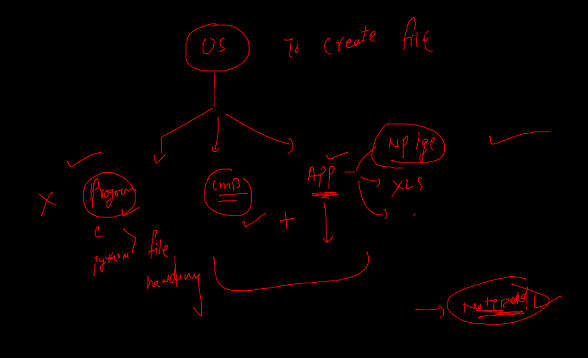
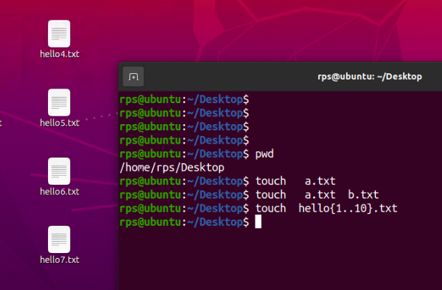
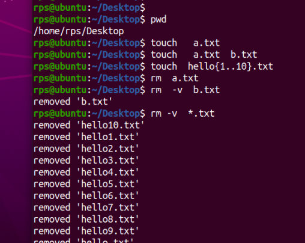
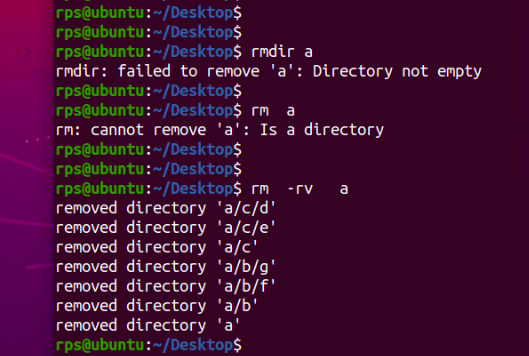

# Every os has internal backed code/ program behind every app

## to open GUI folder 

## cd command demo (change directory / folder)

### Cd demo 

### cd demo 2

### taking help in linux command line -- offline 

### to create file in any OS 

## to create empty files in Linux 

### removing files 

### remove folder 

