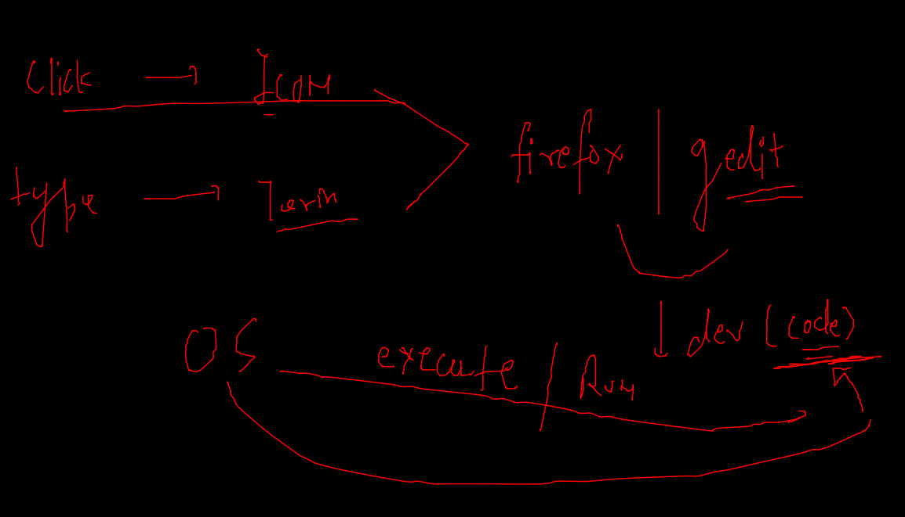
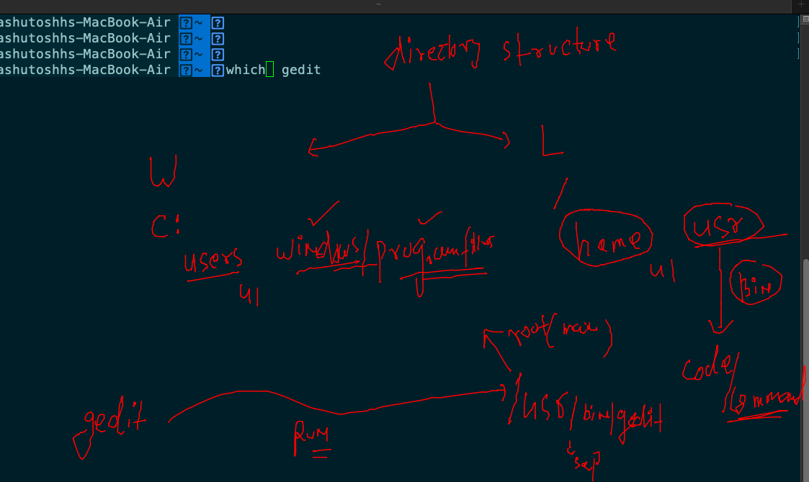

# devops_journey_2022

## OS app backend code 



### Understanding directory /usr/bin



### Remove gedit from root user

```
dheeraj@kubernetes-worker:~$ whoami
dheeraj
dheeraj@kubernetes-worker:~$ 
dheeraj@kubernetes-worker:~$ pwd
/home/dheeraj
dheeraj@kubernetes-worker:~$ 
dheeraj@kubernetes-worker:~$ 
dheeraj@kubernetes-worker:~$ rm /usr/bin/gedit 
rm: remove write-protected regular file '/usr/bin/gedit'? y
rm: cannot remove '/usr/bin/gedit': Permission denied
dheeraj@kubernetes-worker:~$ 
dheeraj@kubernetes-worker:~$ 
dheeraj@kubernetes-worker:~$ sudo -i
[sudo] password for dheeraj: 
root@kubernetes-worker:~# 
root@kubernetes-worker:~# whoami
root
root@kubernetes-worker:~# rm  /usr/bin/gedit 
root@kubernetes-worker:~# 
root@kubernetes-worker:~# which gedit
root@kubernetes-worker:~# 
```

### normal script 

```
dheeraj@kubernetes-worker:~$ whoami
dheeraj
dheeraj@kubernetes-worker:~$ sudo -i
root@kubernetes-worker:~# 
root@kubernetes-worker:~# 
root@kubernetes-worker:~# touch  /usr/bin/gedit
root@kubernetes-worker:~# 
root@kubernetes-worker:~# which gedit
root@kubernetes-worker:~# 
root@kubernetes-worker:~# 
root@kubernetes-worker:~# logout
dheeraj@kubernetes-worker:~$ 
dheeraj@kubernetes-worker:~$ 
dheeraj@kubernetes-worker:~$ 
dheeraj@kubernetes-worker:~$ which gedit
dheeraj@kubernetes-worker:~$ 
dheeraj@kubernetes-worker:~$ 
dheeraj@kubernetes-worker:~$ gedit
-bash: /usr/bin/gedit: Permission denied
dheeraj@kubernetes-worker:~$ 
dheeraj@kubernetes-worker:~$ sudo -i
root@kubernetes-worker:~# 
root@kubernetes-worker:~# chmod +x  /usr/bin/gedit 
root@kubernetes-worker:~# 
root@kubernetes-worker:~# 
root@kubernetes-worker:~# exit
logout
dheeraj@kubernetes-worker:~$ 
dheeraj@kubernetes-worker:~$ gedit
dheeraj@kubernetes-worker:~$ 
dheeraj@kubernetes-worker:~$ 
dheeraj@kubernetes-worker:~$ sudo -i
root@kubernetes-worker:~# 
root@kubernetes-worker:~# 
root@kubernetes-worker:~# echo  firefox  >/usr/bin/gedit 
root@kubernetes-worker:~# 
root@kubernetes-worker:~# cat /usr/bin/gedit 
firefox
root@kubernetes-worker:~# exit
logout
dheeraj@kubernetes-worker:~$ sudo -i
root@kubernetes-worker:~# 
root@kubernetes-worker:~# 
root@kubernetes-worker:~# 
root@kubernetes-worker:~# echo  reboot  >/usr/bin/gedit 
root@kubernetes-worker:~# 
root@kubernetes-worker:~# 
root@kubernetes-worker:~# cat /usr/bin/gedit 
reboot
root@kubernetes-worker:~# exit
logout
dheeraj@kubernetes-worker:~$ 
dheeraj@kubernetes-worker:~$ gedit 
Failed to set wall message, ignoring: Interactive authentication required.
Failed to reboot system via logind: Interactive authentication required.
Failed to open initctl fifo: Permission denied
Failed to talk to init daemon.
dheeraj@kubernetes-worker:~$ sudo  -i
root@kubernetes-worker:~# 
root@kubernetes-worker:~# gedit 
Connection to 192.168.1.9 closed by remote host.

```
