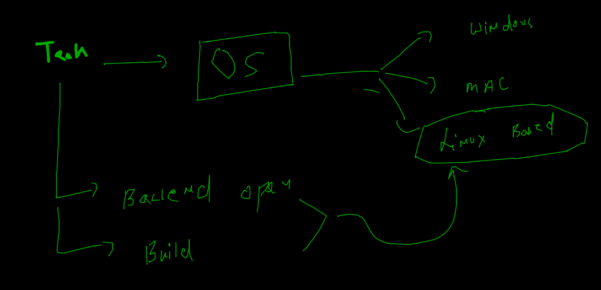
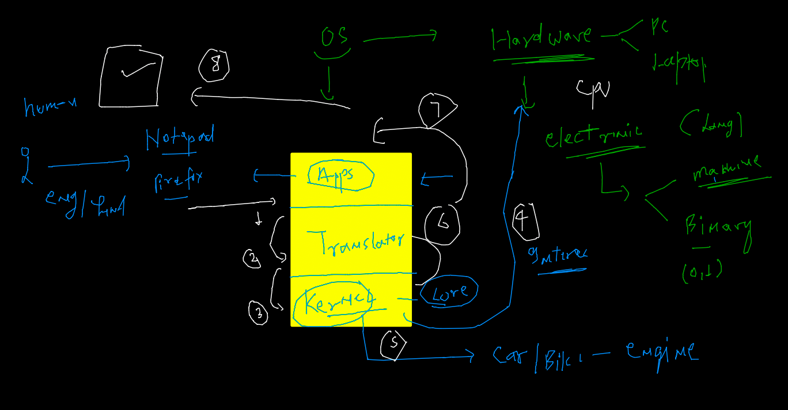
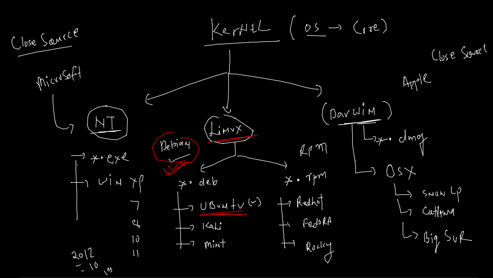
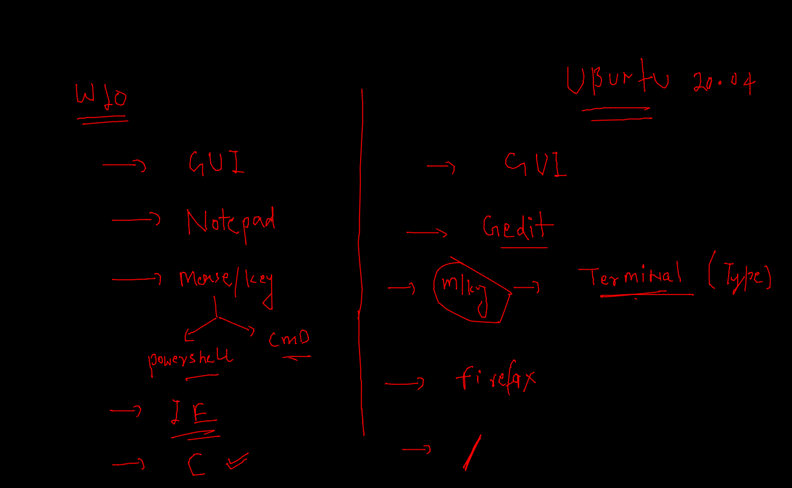

# Tech Understanding with opensource 



## Os working 



## Kernel understanding 



### Ubuntu platform check 

### OPen terminal and type 

### current user 

```
:/# whoami
root

```

### to check os Info 

```
 cat  /etc/os-release 
NAME="Ubuntu"
VERSION="20.04.3 LTS (Focal Fossa)"
ID=ubuntu
ID_LIKE=debian
PRETTY_NAME="Ubuntu 20.04.3 LTS"
VERSION_ID="20.04"


```

### to check kernel name and version 

```
 uname 
Linux
root@775c96f06b2a:/# uname  -r
5.10.47-linuxkit

```

### Windows vs Ubuntu 




